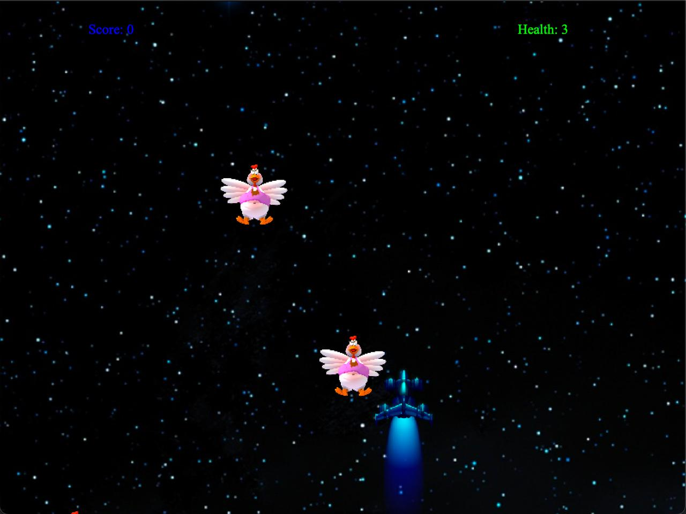
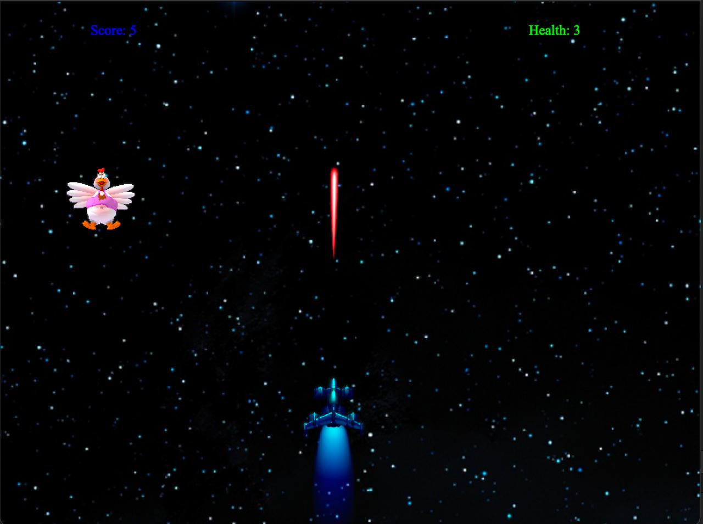

# 🚀 Chicken Invaders – 2D Space Shooter Game

A fully interactive **2D space shooter** inspired by *Chicken Invaders*, built using **C++ and the Qt framework**. This project showcases smooth player controls, enemy waves, collision detection, sound effects, and dynamic score/health tracking through a fast-paced gameplay experience.

---

## 🎮 Game Overview

Players control a spaceship and must shoot incoming enemy chickens while avoiding collisions. Enemies spawn periodically and descend from the top of the screen. The game ends when the player’s health reaches zero.

---

## ✨ Key Features

- ✅ **Player spaceship** – Move using arrow keys and shoot bullets with the spacebar.
- ✅ **Enemy chickens** – Enemies appear randomly and descend toward the player.
- ✅ **Scoring system** – Score increases when enemies are shot.
- ✅ **Health system** – Health decreases when enemies collide or reach the bottom.
- ✅ **Sound effects** – Laser and chicken scream sounds for immersive feedback.

---

## 🛠️ Technologies Used

- **Language:** C++  
- **Framework:** Qt (QGraphicsView, QMediaPlayer)  
- **Concepts:** Object-Oriented Programming, Signals & Slots, Collision Detection, Timers, Scene Management, Audio Playback  

---

## ▶️ How the Game Works

1. **Startup:** Game window (800x600) loads with a space background.
2. **Player Controls:** Move left/right with arrow keys; shoot with the spacebar.
3. **Enemy Spawning:** Every 2 seconds, a new chicken spawns at a random X-coordinate.
4. **Collision Detection:** Bullets destroy enemies; enemies hurt player on contact or when reaching the bottom.
5. **Game Over:** Health reaches zero → game ends → message box shows final score.

---

## 📸 Screenshots

  

---

## 📬 Contact

For inquiries, contact [mahmoudhossam@aucegypt.edu](mailto:mahmoudhossam@aucegypt.edu)
